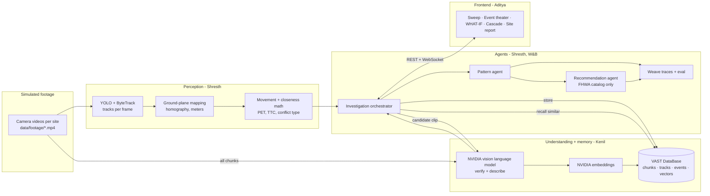

# ALMOST — Master Plan

**One line:** Crash reports tell us where people got hurt. ALMOST is an autonomous investigator that sweeps street-camera footage, finds the crashes that *almost* happened, proves how close they were, shows what would have happened with a fraction of a second less luck, discovers the recurring pattern, and recommends FHWA Proven Safety Countermeasures for an engineer to review, every claim backed by video.

**It is not a search dashboard.** Nobody types queries. You press **FIND THE ALMOSTS** and the agent does the investigation: scan → track → measure → verify → recall similar → find the pattern → recommend → report. Search (VAST) is how the agent *remembers and connects* events, not a box for an analyst.

| Person | Owns | File |
|---|---|---|
| **Kenil** | **NVIDIA video understanding** (verification + descriptions) and **VAST memory**: clips, events, tracks, embeddings, similarity recall | `KENIL.md` |
| **Shresth** | Backend + integration: **YOLO perception** (tracking, ground-plane mapping, closeness measurement), investigation orchestrator, **W&B agents** (patterns, FHWA recommendations), **Weave** tracing + evaluation, API | `SHRESTH.md` |
| **Aditya** | Frontend: the sweep, event theater with trajectory overlay, bird's-eye reconstruction, **WHAT-IF crash simulation**, pattern cascade, site report, calibration tool | `ADITYA.md` |
| **Everyone** | Simulated footage + ground truth (section 9) | — |

**Sponsors and their real jobs**

| Sponsor | Job | Owner |
|---|---|---|
| **NVIDIA** (Video Search and Summarization blueprint / Cosmos Reason vision language model) | Watches each candidate close call and rules **ACCEPT / REJECT / UNSURE** with a reason; describes the interaction, contributing factors and conditions; captions all footage for memory | Kenil |
| **YOLO** (Ultralytics, provided resource) | Finds and tracks every person, bike, car, truck frame by frame | Shresth |
| **VAST** (VAST DataBase + vector search) | The investigator's memory: every clip, track summary, event and embedding. Recalls similar events across cameras and time ("this wasn't isolated") | Kenil |
| **W&B** (Inference + Weave) | Agents that group events into patterns, explain them, and select FHWA countermeasures; Weave traces every step and runs our evaluation | Shresth |

**Key terms (use these words in UI and pitch):**
- **Post-encroachment time (PET):** seconds between the first road user leaving the spot where paths cross and the second one arriving. Smaller = closer call. 0 = collision.
- **Time to collision (TTC):** if both kept their speed and direction, seconds until they'd touch. Smallest value during the event is reported.
- **Close call / "almost":** a verified interaction under our thresholds (section 4.6).

---

## 1. System architecture



### Precompute vs live
- **Precomputed before demo** (heavy): YOLO tracks for all footage, chunk captions + embeddings in VAST. Cached on disk + VAST.
- **Live on button press:** measurement over tracks (fast), NVIDIA verification of the top candidates (cached results allowed if slow, but at least the #1 event is verified live), VAST recall, W&B pattern + recommendation agents, report. All stages stream to the UI.
- Say it honestly if asked: "Tracking was precomputed; the investigation you saw ran live."

---

## 2. End-to-end data flow (one investigation run)

1. **Load** sites/cameras config; tracks from cache (`data/tracks/<camera>.parquet`).
2. **Scan** (Shresth): summarize each track (class, entry/exit leg, movement, ground path at 10 Hz). Stream counters.
3. **Measure** (Shresth): for every pair of road users overlapping in time at a camera, compute crossing point, PET, minimum TTC, speeds → **candidates** (thresholds 4.6). Rank by score.
4. **Verify** (Kenil, NVIDIA): for each candidate (top 15), cut the clip window, send to the vision model with the measured facts → **ACCEPT / REJECT / UNSURE** + description + contributing factors + conditions. REJECTs are shown too (proves we don't just trust geometry).
5. **Remember** (Kenil, VAST): write accepted/rejected events with metrics, verification and description embedding.
6. **Recall similar** (Kenil, VAST): for each accepted event, vector-recall similar events (other times, other cameras), and similar raw chunks perception may have missed (those go back through step 4 if they have tracks).
7. **Pattern** (Shresth, W&B): group accepted events by site + conflict type + movement + conditions; agent writes the pattern summary citing event ids.
8. **Recommend** (Shresth, W&B): for each pattern, agent picks 1–3 countermeasures **only from the FHWA catalog** candidates mapped to that conflict type, explains why with cited events, adds the "for engineer review" caveat. Validator rejects anything not in the catalog.
9. **Report**: per site, patterns + recommendations + evidence, exportable.
10. **WHAT-IF** (Aditya, using Shresth's precomputed gap curve): for any event, slide the timing and watch the simulated crash.

---

## 3. Static configuration (`data/config/`)

### `sites.json`
```json
[{"site_id": "SITE_A", "name": "5th & Market (simulated)", "camera_ids": ["CAM_A1", "CAM_A2"], "speed_limit_mph": 25, "signalized": true}]
```

### `cameras.json`
```json
[{
  "camera_id": "CAM_A1", "site_id": "SITE_A", "label": "NE corner looking SW",
  "video_url": "/media/footage/CAM_A1.mp4", "fps": 30, "width": 1920, "height": 1080,
  "homography": [[...3 numbers...],[...],[...]],
  "ground": {
    "legs": {"N": [[x,y],...], "S": [[...]], "E": [[...]], "W": [[...]]},
    "crosswalks": [{"id": "CW_N", "polygon": [[x,y],...]}],
    "box": [[x,y],...]
  }
}]
```
- `homography` maps image pixels → ground meters (3×3). Made with Aditya's calibration tool (click ≥4 image points, type their ground coordinates) or from simulator camera parameters.
- `legs` = approach polygons in ground meters, used to classify movements (enter leg + exit leg → through / left / right). `crosswalks` used for "in crosswalk" flags.

### `fhwa_countermeasures.json` (Shresth, section 7)

---

## 4. Data formats (contracts)

Times `t` are seconds from the start of that camera's video. Ground units are meters.

### 4.1 Track point (`data/tracks/<camera>.parquet`, one row per track per frame)
| Field | Type |
|---|---|
| camera_id, track_id, cls (`person`,`bicycle`,`motorcycle`,`car`,`bus`,`truck`) | str / int / str |
| frame, t | int / float |
| x1, y1, x2, y2, conf | float (image pixels) |
| u, v | float, image foot point (bottom center of box) |
| gx, gy | float, ground meters (smoothed) |
| speed_mps, heading_deg | float |

### 4.2 Track summary (`track_summaries` in VAST + API)
```json
{"camera_id": "CAM_A1", "track_id": 17, "cls": "car", "t_in": 41.2, "t_out": 49.8,
 "entry_leg": "S", "exit_leg": "E", "movement": "right_turn",
 "path": [[41.2, 3.1, -12.0], [41.3, 3.1, -11.4]],
 "max_speed_mps": 8.4, "dims_m": [4.5, 1.8]}
```
`path` = `[t, gx, gy]` at 10 Hz. `movement` ∈ `through, left_turn, right_turn, u_turn, crossing, unknown` (people/bikes in a crosswalk = `crossing`).

### 4.3 Event (candidate → verified; `events` table in VAST, API shape minus embedding)
```json
{
  "event_id": "EV_A1_0041",
  "site_id": "SITE_A", "camera_id": "CAM_A1",
  "t_conflict": 44.6, "clip": {"t0": 38.0, "t1": 50.0, "url": "/media/clips/EV_A1_0041.mp4", "thumb": "/media/thumbs/EV_A1_0041.jpg"},
  "a": {"track_id": 17, "cls": "car", "movement": "right_turn", "speed_mps": 6.2},
  "b": {"track_id": 9, "cls": "person", "movement": "crossing", "speed_mps": 1.4},
  "conflict_type": "ped_vs_right_turn",
  "conflict_point": [2.4, -3.0],
  "pet_s": 0.7, "min_ttc_s": 0.9, "first_through": "b",
  "severity": "severe", "score": 0.91,
  "verification": {
    "verdict": "ACCEPT", "reason": "Car turns right through crosswalk while pedestrian is mid-crossing; pedestrian steps back.",
    "description": "A gray sedan turning right ...",
    "contributing_factors": ["driver did not yield", "pedestrian partly hidden by parked van"],
    "conditions": {"lighting": "day", "weather": "clear", "visibility_issue": true},
    "evasive_action": "pedestrian stepped back",
    "model": "cosmos-reason", "confidence": 0.82
  },
  "pattern_id": "PAT_A_01",
  "status": "verified"
}
```
`conflict_type` ∈ `ped_vs_right_turn, ped_vs_left_turn, ped_vs_through, bike_vs_right_turn, bike_vs_through, veh_left_turn_vs_through, veh_angle, veh_rear_end, other`.
`verdict` ∈ `ACCEPT, REJECT, UNSURE`. `status` ∈ `candidate, verified, rejected, unsure`.

### 4.4 WHAT-IF payload (`GET /events/{id}/whatif`, Shresth computes, Aditya renders)
```json
{
  "event_id": "EV_A1_0041",
  "shift_actor": "a",
  "a": {"cls": "car", "dims_m": [4.5, 1.8], "path": [[t, gx, gy, heading_deg], ...]},
  "b": {"cls": "person", "radius_m": 0.35, "path": [[t, gx, gy], ...]},
  "image_paths": {"a": [[t, u, v], ...], "b": [[t, u, v], ...]},
  "homography_inv": [[...],[...],[...]],
  "observed": {"pet_s": 0.7, "min_gap_m": 1.1},
  "gap_curve": [[-3.0, 6.2], [-2.95, 6.0], ..., [0.7, -0.4], ...],
  "contact_ranges": [[0.55, 1.05]],
  "first_contact_shift_s": 0.55,
  "impact": {"shift_s": 0.7, "t": 45.3, "point": [2.4, -3.0], "speed_mps": 6.2},
  "disclaimer": "Simulation along observed paths only. Real crash dynamics differ."
}
```
`gap_curve` = `[shift_s, min_gap_m]` every 0.05 s from −3 to +3 s; `min_gap_m ≤ 0` means contact.

### 4.5 Pattern + recommendation
```json
{"pattern_id": "PAT_A_01", "site_id": "SITE_A", "conflict_type": "ped_vs_right_turn",
 "signature": "right-turning vehicles from S leg vs pedestrians in east crosswalk",
 "event_ids": ["EV_A1_0041", "EV_A1_0112", "EV_A2_0033", "EV_A1_0207"],
 "count": 4, "worst_pet_s": 0.7, "median_pet_s": 1.2,
 "conditions": {"day": 3, "night": 1},
 "summary": "Four close calls in 12 minutes where right-turning drivers entered the east crosswalk ...",
 "recommendations": [{
   "countermeasure_id": "leading_pedestrian_interval",
   "name": "Leading Pedestrian Interval",
   "source": "FHWA Proven Safety Countermeasures",
   "url": "https://highways.dot.gov/safety/proven-safety-countermeasures/leading-pedestrian-interval",
   "why": "In 3 of 4 events the pedestrian had already started crossing when the turning vehicle arrived (EV_A1_0041, EV_A1_0112, EV_A2_0033).",
   "cited_event_ids": ["EV_A1_0041", "EV_A1_0112", "EV_A2_0033"],
   "review_note": "Suggested for traffic engineer review; not a verified design decision."
 }]}
```

### 4.6 Thresholds (project choices, configurable in `backend/config.py`; say "our thresholds", not an official standard)
- Candidate if `pet_s < 3.0` or `min_ttc_s < 2.0`.
- Severity: `severe` PET < 1.0 s · `moderate` 1.0–2.0 s · `low` 2.0–3.0 s.
- Score = `0.6 * (1 - min(pet,3)/3) + 0.3 * (1 - min(ttc,2)/2) + 0.1 * vulnerable_user_bonus`.

### 4.7 Chunk (VAST `chunks` table: memory of all footage)
`chunk_id, camera_id, site_id, t_start, t_end, caption, observations(JSON), embedding, clip_url, thumb_url`.

---

## 5. Interfaces

### Kenil → Shresth (Python package `memory/`, imported by backend)
```python
verify_event(event: dict, clip_path: str) -> dict               # returns event["verification"] (4.3)
store_event(event: dict) -> None                                  # upsert into VAST events (+ description embedding)
store_track_summaries(rows: list[dict]) -> None                   # VAST track_summaries
similar_events(event_id: str, k: int = 8, exclude_ids: list[str] = []) -> list[{"event": dict, "score": float}]
similar_chunks(text: str, k: int = 10, site_id: str | None = None) -> list[{"chunk": dict, "score": float}]
index_footage(camera_id: str) -> int                              # precompute chunk captions + embeddings
get_event(event_id) -> dict ; list_events(site_id=None, status=None) -> list[dict]
```

### Shresth → Aditya (REST, `VITE_API_BASE`, default `http://localhost:8000`)
| Method | Path | Returns |
|---|---|---|
| GET | `/config` | `{sites, cameras}` |
| POST | `/investigate` `{"site_ids": null}` | `{"run_id"}`; progress via WebSocket |
| GET | `/runs/{run_id}` | `{stages, counts, event_ids, pattern_ids}` |
| GET | `/events?site_id=&status=` | list of events (4.3) |
| GET | `/events/{id}` | event + `overlay` (image-space tracks for the clip: `{a:[[t,u,v,x1,y1,x2,y2]], b:[...]}`) |
| GET | `/events/{id}/whatif` | WHAT-IF payload (4.4) |
| GET | `/events/{id}/similar` | similar events from VAST |
| GET | `/patterns?site_id=` / `/patterns/{id}` | patterns with recommendations (4.5) |
| GET | `/report/{site_id}` | `{site, patterns, recommendations, top_events, generated_at, disclaimer}` |
| GET | `/report/{site_id}.md` | Markdown export |
| GET | `/eval/latest` | metrics + Weave link |
| PUT | `/cameras/{id}/calibration` | save homography + ground config from the calibration tool |
| GET | `/media/*` | footage, clips, thumbs |
| WS | `/ws` | below |

### WebSocket (backend → frontend)
```json
{"type": "run.stage", "run_id": "r1", "stage": "scan|measure|verify|remember|recall|pattern|recommend|report", "status": "start|progress|done", "progress": 0.4,
 "counts": {"video_minutes": 48, "road_users": 1312, "interactions": 9480, "candidates": 23, "verified": 9, "rejected": 6, "patterns": 3}}
{"type": "run.candidate", "event": { "...4.3 status=candidate..." }}
{"type": "run.verified", "event_id": "EV_A1_0041", "verdict": "ACCEPT", "reason": "..."}
{"type": "run.similar", "event_id": "EV_A1_0041", "similar_ids": ["EV_A1_0112", "EV_A2_0033"]}
{"type": "run.pattern", "pattern": { "...4.5..." }}
{"type": "run.recommendation", "pattern_id": "PAT_A_01", "recommendation": { "..." }}
{"type": "run.done", "run_id": "r1"}
```

---

## 6. Repository layout
```
almost/
  data/footage/ clips/ thumbs/ tracks/ chunks/ config/ ground_truth/
  memory/     # Kenil: vision.py embed.py vast_store.py recall.py index_footage.py
  backend/    # Shresth: main.py perception/ (track.py calibrate.py summarize.py conflicts.py whatif.py)
              #          agents/ (orchestrator.py patterns.py recommend.py prompts.py) evals/ config.py
  frontend/   # Aditya
```

## 7. FHWA countermeasure catalog (recommendations may ONLY come from here)

Source: FHWA Proven Safety Countermeasures, `https://highways.dot.gov/safety/proven-safety-countermeasures`. Shresth builds `fhwa_countermeasures.json` with `{id, name, url, focus_area, addresses: [conflict_types/conditions], summary_in_our_words}` and a **URL check at startup** (every URL must return 200; fix slugs from the FHWA index page if not).

| Conflict type / condition | Candidate FHWA countermeasures |
|---|---|
| `ped_vs_right_turn`, `ped_vs_left_turn` | Leading Pedestrian Interval; Crosswalk Visibility Enhancements |
| `ped_vs_through` at uncontrolled crossing | Rectangular Rapid Flashing Beacons; Pedestrian Hybrid Beacons; Medians and Pedestrian Refuge Islands; Crosswalk Visibility Enhancements |
| `bike_vs_right_turn`, `bike_vs_through` | Bicycle Lanes |
| `veh_left_turn_vs_through`, `veh_angle` | Dedicated Left- and Right-Turn Lanes at Intersections; Reduced Left-Turn Conflict Intersections; Roundabouts |
| high approach speeds (speed > limit in events) | Appropriate Speed Limits for All Road Users; Speed Safety Cameras |
| night events / visibility issue | Lighting |
| red-light entry suspected | Backplates with Retroreflective Borders; Yellow Change Intervals |

---

## 8. Environment variables
`NVIDIA_API_KEY`, `VSS_HOST`, `VLM_MODEL`, `EMBED_MODEL`, `EMBED_DIM` (Kenil) · `VAST_ENDPOINT`, `VAST_ACCESS_KEY`, `VAST_SECRET_KEY`, `VAST_BUCKET`, `VAST_SCHEMA` (Kenil) · `YOLO_MODEL` (e.g. `yolo11m.pt`), `WANDB_API_KEY`, `WANDB_ENTITY`, `WANDB_PROJECT=almost`, `LLM_MODEL` (Shresth) · `VITE_API_BASE`, `VITE_WS_URL` (Aditya).

## 9. Simulated footage + ground truth (everyone, first)

Footage is simulated (team picks the tool: a driving simulator such as CARLA, generated video, or staged). If you use a simulator, **export ground-truth positions**: that gives exact PET for evaluation.

**Requirements:** 3–4 sites, 1–2 cameras each, fixed elevated view like a real traffic camera, 2–4 minutes per camera, normal traffic in between. Scenarios (each must **repeat 3–4 times** at its site so the pattern agent has something to find):

| Site | Scenario | Expected FHWA candidates |
|---|---|---|
| A | Right-turning car vs pedestrian in crosswalk (one includes a van blocking view) | Leading Pedestrian Interval, Crosswalk Visibility Enhancements |
| B | Left-turning car vs oncoming through car | Dedicated turn lanes, Reduced Left-Turn Conflict Intersections, Roundabouts |
| C | Right-turning car vs cyclist going straight ("right hook") | Bicycle Lanes |
| D | Pedestrian crossing mid-block vs fast through car, at night | RRFB / PHB / Refuge Islands, Lighting, Appropriate Speed Limits |

Plus **decoys** (close passes that are *not* conflicts, e.g. pedestrian waiting at the curb as a car passes) so verification visibly REJECTs some. Plus **one actual crash** clip (simulated) for the pitch comparison: "this is what 0.7 seconds looks like."

`data/ground_truth/events.json`: `{gt_id, camera_id, t, a_cls, b_cls, conflict_type, true_pet_s (if simulator), is_conflict (false for decoys)}`.

## 10. Evaluation (Weave, Shresth runs; shown in UI)
- **Detection:** recall and precision of candidates vs ground truth (±1.5 s, same camera, same classes).
- **Measurement:** mean absolute PET error vs simulator truth.
- **Verification:** NVIDIA verdict accuracy vs `is_conflict` (decoys must be REJECT).
- **Patterns:** purity (events in a pattern share the true conflict type).
- **Recommendations:** 100% from catalog, URLs valid, every claim cites accepted events; mapping correctness vs table above.

## 11. Timeline (short build; adjust to the real clock)
| Block | Kenil | Shresth | Aditya |
|---|---|---|---|
| 1 | VAST + NVIDIA access, schemas | YOLO tracking on first footage, calibration format | App shell, mock data, calibration tool |
| 2 | Chunk index into VAST; `verify_event` | Summaries, PET/TTC, candidates, WHAT-IF curves | Sweep screen, event theater, overlay |
| 3 | `similar_events`, `store_event` | Orchestrator, W&B pattern + recommend agents, API | WHAT-IF sim, cascade, report |
| 4 | Verify all candidates, tune prompt | Weave eval, integration lead | Polish, projector test |
| Last 30 min | Full runs ×2, backup video recorded | | |

## 12. Demo script (3 minutes)
1. **Hook (15 s):** "Every crash statistic starts as a near miss nobody saw. Today someone almost got hit. They walked home, so it never became a report."
2. **The wall:** 10+ feeds. Press **FIND THE ALMOSTS**. Counters race: minutes scanned, road users tracked, interactions measured. Tiles dim. NVIDIA verdicts tick: ACCEPT / REJECT (show one decoy rejected: "we don't trust geometry alone").
3. **Collapse:** hundreds of interactions → 9 verified close calls, ranked. The worst explodes fullscreen: trajectories draw over the real video, bird's-eye view mirrors it, **margin: 0.7 seconds**.
4. **WHAT-IF:** drag the slider. The ghost car slides later in time. At +0.55 s the margin hits zero: impact flash. "This is how close it was."
5. **"This wasn't isolated":** VAST recalls three more like it, at different times and cameras; they cascade in. Pattern card: "right-turning drivers vs pedestrians in the east crosswalk, 4 times in 12 minutes."
6. **Recommendation:** FHWA Leading Pedestrian Interval, linked, with the three events that justify it. "For engineer review."
7. **Proof (15 s):** eval panel: detection recall, PET error, verification accuracy, every step traced in Weave.
8. **Close:** "They made it home today. ALMOST makes sure we learn from it before the next one doesn't."
